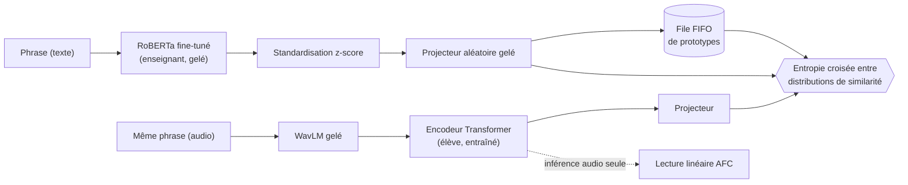

# Détection et classification multimodales de sophismes argumentatifs

Reproduction critique, extensions et **nouvelle méthode de distillation intermodale texte → audio** pour le shared task
**MM-ArgFallacy2025** ([Mancini et al., ArgMining @ ACL 2025](https://aclanthology.org/2025.argmining-1.35/)),
sur les débats présidentiels américains, avec [MAMKit](https://github.com/nlp-unibo/mamkit).

- **AFD** : détection de sophismes (F1 binaire). **AFC** : classification en 6 catégories (F1 macro).
- Entrées : texte, audio, ou texte + audio. Découpage officiel : entraînement sur MM-USED-Fallacy, test sur les deux débats de 2024.
- Chaque configuration est entraînée avec 3 graines (42, 2024, 666) ; les comparaisons reposent sur un bootstrap apparié sur le test.

**Rapport** : [`docs/rapport.pdf`](docs/rapport.pdf) (analyse critique, protocole, résultats et discussion).

## Méthode proposée : distillation intermodale texte → audio

Dans MM-ArgFallacy2025, l'audio reste très en dessous du texte : entraîné directement sur environ 1 000
étiquettes AFC, un modèle acoustique n'apprend presque rien. Nous proposons de **transférer la structure de
l'espace texte vers l'audio, sans étiquettes**, en exploitant toutes les phrases alignées des débats
d'entraînement (environ 16 000 paires texte–audio au lieu de 1 000 exemples étiquetés). À l'inférence,
le modèle n'utilise **que l'audio**.



**Principe.** Pour chaque paire, l'élève audio apprend à reproduire la distribution de similarité de
l'enseignant texte vis-à-vis d'une file de prototypes (τ_enseignant < τ_élève) ; le gradient ne passe que par l'élève.
La perte par file de prototypes s'inspire de COMODO ([Chen et al., 2025](https://arxiv.org/abs/2503.07259)),
conçu pour la distillation vidéo → capteurs inertiels. Notre méthode l'adapte à un **nouveau couple de modalités et
à une nouvelle tâche** :

- **Inversion texte → audio** : un enseignant linguistique spécialisé en sophismes guide un élève acoustique.
- **Standardisation de l'enseignant** : les représentations de RoBERTa sont anisotropes (similarité cosinus ≈ 0,9),
  ce qui rend la cible uniforme et bloque l'apprentissage ; un z-score calculé sur l'entraînement la ramène à 0,12.
- **Température d'alignement** choisie sur la validation (τ = 0,02, alignement au niveau de l'instance).
- **Élève compatible avec la baseline** : même encodeur audio que la baseline MAMKit, donc comparaison directe.

**Protocole d'évaluation.** La méthode est évaluée face à des contrôles qui isolent chaque facteur :
features WavLM brutes (**raw**), même élève entraîné de façon **supervisée**, enseignant **générique** non
fine-tuné, complémentarité **[raw ; élève]**, et **efficacité en étiquettes** (lectures sur 10, 25 et 50 %
des étiquettes, sous-échantillons appariés).

| Représentation audio (AFC) | F1 macro | Δ vs raw [IC 95 %] |
|---|---|---|
| Baseline audio MAMKit | 0,128 ± 0,043 | |
| raw : WavLM gelé moyenné | 0,189 ± 0,010 | référence |
| Élève supervisé | 0,161 ± 0,005 | −0,028 [−0,072 ; +0,023] |
| Élève distillé, enseignant générique | 0,167 ± 0,011 | −0,022 [−0,069 ; +0,023] |
| **Élève distillé, enseignant fine-tuné** | **0,201 ± 0,031** | **+0,012** [−0,036 ; +0,056] |

**Ce que montre la méthode.**

- La distillation obtient le **meilleur score moyen des représentations acoustiques** : elle dépasse la baseline
  audio MAMKit (0,128), l'élève supervisé et l'élève distillé depuis un enseignant générique.
- **La connaissance de l'enseignant est transférée** : l'enseignant fine-tuné sur les sophismes bat l'enseignant
  générique de **+0,034** (IC 95 % [+0,005 ; +0,061], p = 0,022), seul effet significatif de l'étude.
- Elle ne dépasse pas significativement les features WavLM brutes, ni avec toutes les étiquettes ni avec 10 % d'entre elles :
  l'information transmise par l'enseignant est déjà présente dans WavLM, affiné pour la transcription. Combiné à la
  cascade parole → texte (0,380), ce résultat localise l'information de l'audio : elle est **lexicale, non prosodique**.
- La méthode est prête pour les cas où l'audio porte une information propre (annotations multimodales, vidéo),
  et pour un élève aux couches hautes dégelées.

```bash
python -m src.experiments.distill --teacher finetuned --teacher-temp 0.02 --label-fractions 0.1 0.25 0.5 --seeds 42 2024 666
python -m src.experiments.distill --mode raw --seeds 42 2024 666          # contrôle raw
python -m src.experiments.distill --mode supervised --seeds 42 2024 666   # contrôle supervisé
```

Code : [`src/models/distillation.py`](src/models/distillation.py) (enseignant, élève, perte),
[`src/experiments/distill.py`](src/experiments/distill.py) (entraînement, contrôles, lectures).

## Reproduction des baselines

Baseline Transformer (RoBERTa / WavLM, fusion tardive), moyenne ± écart-type sur 3 graines.

| Tâche | Modalité | Article | Nous |
|---|---|---|---|
| AFC | Texte | 0,3925 | 0,3885 ± 0,040 |
| AFC | Audio | 0,0643 | 0,1280 ± 0,043 |
| AFC | Texte + audio | 0,3816 | 0,3905 ± 0,016 |
| AFD | Texte | 0,2770 | 0,2711 ± 0,005 |
| AFD | Audio | 0,0000 | 0,0000 ± 0,000 |
| AFD | Texte + audio | 0,2848 | 0,2728 ± 0,004 |

## Autres extensions

AFC sauf mention contraire.

| Expérience | Résultat |
|---|---|
| RoBERTa fine-tuné, poids de classes recalculés sur l'entraînement | AFC 0,381 ± 0,043, AFD 0,301 ± 0,012 |
| Audio seul, transcription Whisper → modèle texte | 0,380 ± 0,045 |
| Meilleure fusion vs concaténation (taux d'apprentissage choisi sur la validation) | 0,360 vs 0,391 |
| Contexte dialogique n−1 (moyenne sur la paire / sur la cible seule) | 0,305 / 0,371 |
| Multi-tâche avec la détection de phrases argumentatives | 0,373 ± 0,014 (contrôle 0,364) |
| Explicabilité : six méthodes d'attribution évaluées (fidélité, accord, stabilité) | attention à peine plus fidèle que le hasard |

## Installation

```bash
conda create -n mm_argfallacy python=3.10 && conda activate mm_argfallacy
pip install -r requirements.txt
conda install -c conda-forge ffmpeg deno     # traitement audio ; runtime JavaScript requis par yt-dlp
```

Les données sont téléchargées et découpées en extraits par MAMKit (37 débats, environ 30 h d'audio) :

```bash
python -m src.data.prepare
```

Données, caractéristiques et résultats sont écrits dans `data/`, `cache/` et `results/`
(modifiables avec `MAMKIT_DATA_PATH` et `MAMKIT_FEATURE_CACHE`).

## Reproduction

```bash
bash scripts/reproduce_baselines.sh      # Tableau 4 : 2 tâches x 3 modalités x 3 graines
bash data_exploration/run_all.sh         # exploration des données et transcriptions Whisper
bash scripts/run_extensions.sh           # toutes les extensions, dont la distillation
```

Exécutions individuelles :

```bash
python -m src.experiments.baseline --task afc --modality text --seeds 42 2024 666
python -m src.experiments.baseline --task afc --modality text --finetune --imbalance weighted_train --save-model --seeds 42 2024 666
python -m src.experiments.baseline --task afc --modality text_audio --fusion crossattn --lr 5e-5 --seeds 42 2024 666
python -m src.evaluation.bootstrap --task afc --a <exécution A> --b <exécution B>
```

Chaque exécution écrit `metrics.npy` et les prédictions de test de chaque graine dans
`results/mmused-fallacy/mm-argfallacy-2025/<tâche>/<exécution>/`. Le nom de l'exécution encode
la configuration, par exemple `text_only_roberta_ft_imb-weighted_train_ctx1`.

## Structure du dépôt

```
src/
  data/          préparation des données, cache des caractéristiques audio
  models/        distillation texte → audio, modèles de fusion, contexte dialogique
  training/      boucle d'entraînement, runners, options d'expérience, stratégies de déséquilibre
  experiments/   points d'entrée : distill, baseline, cascade, multitask, xai
  evaluation/    agrégation du Tableau 4, analyse par classe, bootstrap apparié, analyses a posteriori
data_exploration/  E1 étiquettes et texte, E2 audio et prosodie, E3 audit de l'alignement
scripts/           scripts de reproduction de bout en bout
docs/              rapport
```

## Remarques

Par rapport aux démos de MAMKit, le code : évalue sur le découpage officiel du shared task ;
calcule le F1 AFC en moyenne macro ; encode les étiquettes manquantes de sorte que les phrases
non fallacieuses de 2024 soient étiquetées 0 en AFD ; recherche les configurations par égalité ;
et refixe la graine après le prétraitement, pour que les résultats ne dépendent pas du cache.

## Références

```bibtex
@inproceedings{mancini-etal-2025-overview,
  title     = {Overview of {MM}-{A}rg{F}allacy2025 on Multimodal Argumentative Fallacy Detection and Classification in Political Debates},
  author    = {Mancini, Eleonora and Ruggeri, Federico and Villata, Serena and Torroni, Paolo},
  booktitle = {Proceedings of the 12th Workshop on Argument Mining},
  year      = {2025}
}

@inproceedings{mancini-etal-2024-mamkit,
  title     = {{MAMK}it: A Comprehensive Multimodal Argument Mining Toolkit},
  author    = {Mancini, Eleonora and Ruggeri, Federico and Colamonaco, Stefano and Zecca, Andrea and Marro, Samuele and Torroni, Paolo},
  booktitle = {Proceedings of the 11th Workshop on Argument Mining},
  year      = {2024}
}

@article{chen-etal-2025-comodo,
  title   = {{COMODO}: Cross-Modal Video-to-{IMU} Distillation for Efficient Egocentric Human Activity Recognition},
  author  = {Chen, Baiyu and Wongso, Wilson and Li, Zechen and Khaokaew, Yonchanok and Xue, Hao and Salim, Flora},
  journal = {arXiv preprint arXiv:2503.07259},
  year    = {2025}
}
```
